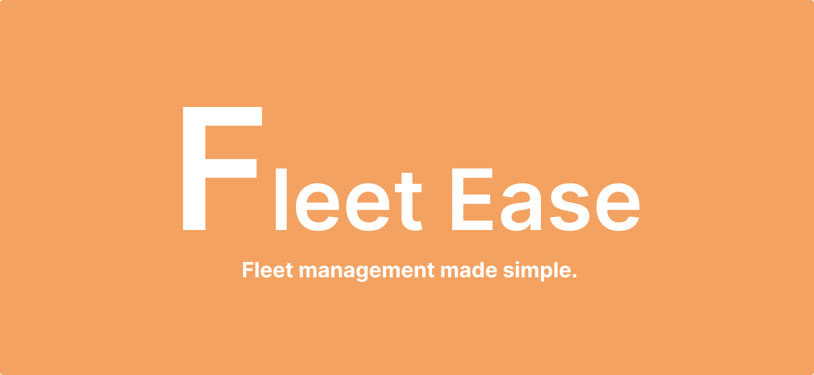
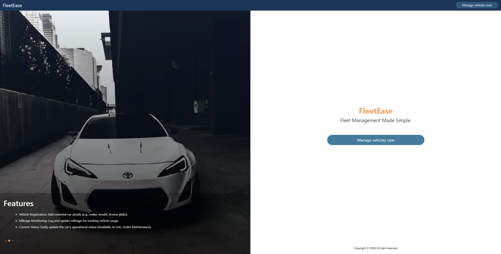
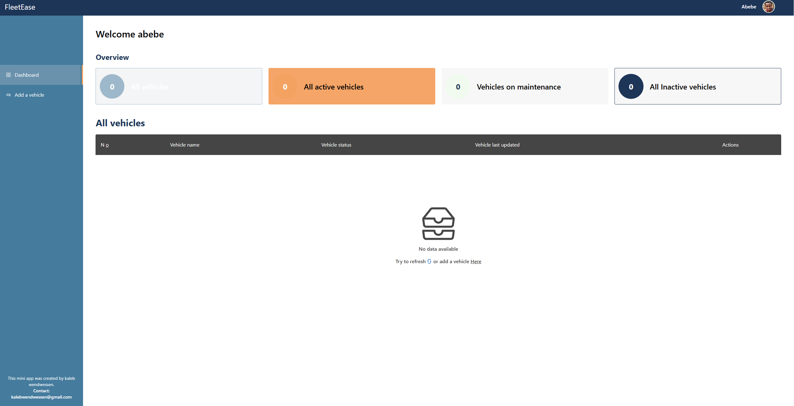
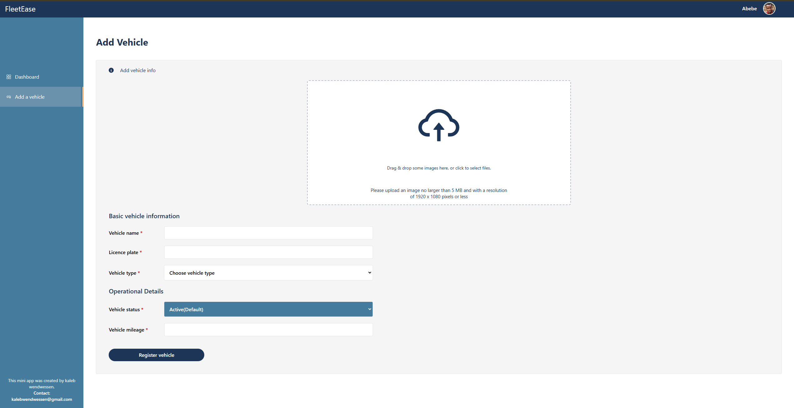

<p></p>

### Table of contents
* [Project name](#project-name)
* [Introduction](#introduction)
* [Directories](#directories)
* [Installation](#installation)
* [Contributing](#contributing)

## Project name
# Fleet-East (Mini-App)

## Introduction
Welcome to Fleet Ease, the Mini App for streamlined fleet management. This platform empowers businesses to efficiently monitor and manage their vehicles. Explore the live demo here.

If you find this project insightful or have suggestions for improvement, feel free to connect with me on LinkedIn. 

## Directories
* [Frontend](./frontend/)
* [Backend](./backend/)

## Installation
To get started with this project, follow these steps:
```bash
# Clone the repository
   git clone https://github.com/leonileo/Fleet-Ease.git
   cd Fleet-Ease

# Install dependencies

#   If you're using npm
    npm install 

#   or if you're using yarn
    yarn install

# Create a .env file in the root directory or use the format of env_example file and add the following environment variables
    MONGO_URI=
    NODE_ENV=""
    cloud_name=""
    cloudinary_api_key=""
    cloudinary_api_secret=""
    Origin=""
# Start the development server

#   To start both servers
    npm run dev
    
#   For frontend
    cd frontend
    npm run dev

#   For backend
    cd backend
    npm run server
```

## Usage
### 1. Get started:
*   Click the manage vehicles now button.
### 2. Explore the dashboard features:
*   Add and manage vehicles with detailed information.
*   Track vehicle status, including active, inactive, and maintenance modes.
*   View vehicle registration dates and update details as needed.
### 3. Admin Features:
*   Monitor fleet activity through a comprehensive dashboard.
*   Update vehicle statuses and information dynamically.
*   Upload and manage vehicle images seamlessly.

## Features showcased visually

### Landing page
<p> </p>

### Dashboard page
<p> </p>

### Add-vehicle page
<p> </p>

## Contributing
###### Mini-App
- Kaleb wendwessen - [Github](https://github.com/leonileo) / [Linkedin](https://linkedin.com/in/kaleb-wendwessen) 
